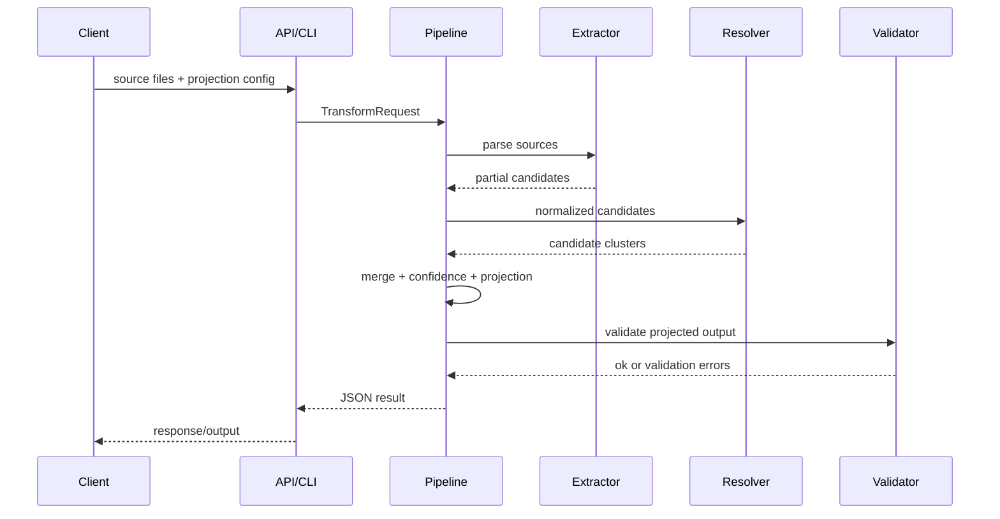

# Architecture

The transformer is organized as a pipeline of small, deterministic stages. Each stage receives typed data and returns typed data. The FastAPI and CLI layers only adapt transport-specific inputs into the pipeline.

## Modules

- `ingestion`: identifies source type and wraps raw payloads.
- `extraction`: parses CSV, ATS JSON, resume PDF, GitHub JSON, and recruiter notes into partial candidate records.
- `normalization`: canonicalizes values for names, emails, phones, URLs, skills, and numeric experience.
- `embeddings`: provides SentenceTransformer-backed vectors and a deterministic hash implementation for tests/offline execution.
- `entity_resolution`: finds likely duplicate candidates using exact identifiers, RapidFuzz, and semantic similarity.
- `merge`: chooses field winners and combines multi-valued fields.
- `confidence`: computes explainable field and aggregate confidence.
- `provenance`: tracks the source and field path for every emitted value.
- `projection`: applies runtime field selection, renaming, missing-value, and metadata policies.
- `validation`: validates final JSON against `schemas/candidate.schema.json`.
- `api`: exposes `POST /transform`.
- `cli`: implements `python main.py --resume resume.pdf --csv recruiter.csv --config config.json`.
- `utils`: logging, config, timing, errors.

## Sequence

